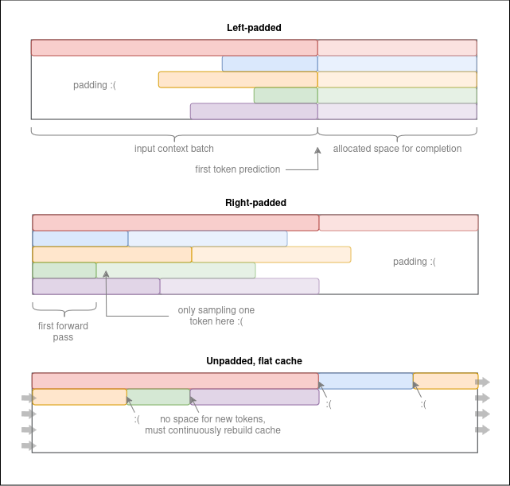
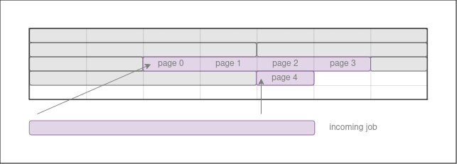
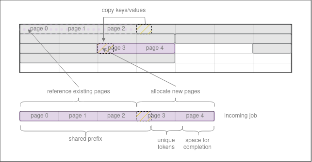
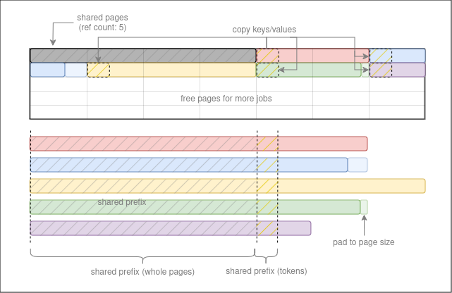

# Dynamic generator

Here is a little writeup about the dynamic generator introduced with ExLlamaV2 v0.1.0. I'll try to
keep this updated with any changes. At the time of writing, the latest release of ExLlamaV2 is
**v0.1.4**


## Static batching

There are a number of approaches to arranging uneven batches in a key/value cache, and most of them 
have drawbacks.

The "base" and "streaming" generators in ExLlama use left-padding, which is arguably the least bad 
solution when we want a static, pre-allocated cache and we must pass an uneven batch to the model as a
rectangular tensor of input IDs. It aligns all sequences to the right, and each forward pass gives us
last-token logits for the entire batch. The downside, of course, is that the padding is wasted space,
and attention functions that support left padding (which do *not* currently include Flash Attention) 
will still waste time attending to the padding tokens before discarding the masked weights.

Padding on the right is another option. It removes the need for an attention mask but introduces 
another problem of having to start inference with the shortest sequence, generating at a lower effective
batch size until all sequences in the batch are the same length. Again, the padding also wastes space.

Flash Attention does support an unpadded cache. The featurev seems geared more toward training than 
inference, however, since it doesn't allow for gaps in the key/value inputs. I.e., we can perform 
attention on an uneven batch, but then we have to reshape the entire cache to grow each individual 
sequence by one token for the next forward pass.



## Continuous batching

Starting with version 2.5.7, Flash Attention supports paged attention. This allows continuous batching:
since the cache is indexed by a block table, we can shape it however we want, leaving space for 
sequences to grow without resorting to padding.


The only space wasted is whatever it takes to align sequences to page boundaries. (The page size is 
fixed at 256 tokens currently.)

## Dynamic Generator

Despite its name, and not to get hung up on definitions, the dynamic generator in ExLlama does what
would usually be referred to as continuous batching, although it could also be thought of as a "hybrid
approach." If we were getting hung up on definitions.

The important point is that the paged attention model lets us add or remove sequences from a batch at 
any point by merely updating the block index, without having to reshape the entire cache.

The generator works on a job queue. Initially it will start as many job as it can fit in the cache,
and as soon as a job finishes, those pages are freed to make room for the next job in the queue (which
may have been part of the original queue or added along the way).

Of course, freeing pages is likely to leave gaps in the cache:


Paged attention helps out here, since there's no requirement for the block index to be contiguous. The
next job that's activated can simply fill whatever gaps have opened up.



The cache can also be defragmented, but for smoother operation the generator will only defragment
unreferenced pages, when the queue is empty.


## Deduplication

The block table offers another great benefit: multiple sequences can index the same pages. A very common
situation in LLM inference involves multiple prompts repeating a shared prefix. This could be a long system
prompt, for instance.

So whenever the generator activates a new job, in the likely event that this job starts with a token 
sequence whose keys/values are already present in the cache, it can reference or reuse the existing data 
to save prefill time and VRAM.



Consider the case of starting a number of jobs that share a long prompt but with slight variation at the
end. There's a concrete example [here](../examples/inference_dedup.py) in which an instruct model is asked
multiple independent questions about a short story. Each prompt in the batch includes the entire story
followed by a unique question, which the generator automatically reduces to something like this:



The referenced example uses a cache that's too short to hold all the jobs at once. This is not a problem,
since as soon as enough jobs finish to leave room for a pending job to become active, the newly activated
job can still reference pages from the exisiting, ongoing jobs.

This also greatly simplifies the batching API. Once you've configured the generator to the capabilities
of your hardware (most notably available VRAM for the cache), you won't need to manage this feature at all.

```python
# Generate a story
story = generator.generate(
    prompt = "Once upon a time",
    max_new_tokens = 1000,
)

# Generate 100 stories
stories = generator.generate(
    prompt = ["Once upon a time"] * 100,
    max_new_tokens = 1000,
)
```

The latter generation may run at a batch size of 100 if the generator is configured to allow that (most
notably if the cache is large enough) or it may maintain a batch size of 17 throughout if that's all it can
fit, but either way it will return the requested 100 completions. (There are other modes it can run in, 
too, to support streaming and so on, see below.)

The [MMLU](../eval/mmlu.py) and [HumanEval](../eval/humaneval.py) scripts in the repo queue up thousands of
jobs in this manner and simply call the generator in a loop, collecting the output as each job completes.   


## Prompt caching

We're not limited to reusing keys/values from jobs that are currently active. The generator tries to avoid
overwriting the most recently used pages, so if the next job received shares a prefix with any of the
most recently finished jobs, the cached data can still be reused.

The most immediate benefit is the same that the original streaming generator already provided: in a chatbot
application, unless you're editing the past, each successive round can reuse the cache for the entire
context up to the user's most recent prompt.

The dynamic generator extends this to include as many past contexts as there is room for in the cache. If 
you're alternating between two contexts and the cache is large enough, you won't have to forget one context
to make room for the other.


## How to

For a quick introduction to the API, let's start by loading Llama3-8B with a 64k-token cache:

```python
from exllamav2 import ExLlamaV2, ExLlamaV2Config, ExLlamaV2Cache, ExLlamaV2Tokenizer

model_dir = "/mnt/str/models/llama3-8b-exl2/4.0bpw/"
config = ExLlamaV2Config(model_dir)
model = ExLlamaV2(config)
cache = ExLlamaV2Cache(model, max_seq_len = 65536, lazy = True)
model.load_autosplit(cache, progress = True)
tokenizer = ExLlamaV2Tokenizer(config)
```

This is the same procedure as usual. Note, however, that the model and cache are initialized without a
batch size, i.e. with an implicit batch size of one. The dynamic generator will still allow batching.

We will be limited by the native max sequence length of the model, which is 8k in this case, but we
could extend it, as before, by updating `config.max_seq_len` and `config.scale_alpha_value` etc. before 
loading the model. In any case, the model's max sequence length only gives the maximum length of any *one*
sequence, so in this example, the 64k-token cache could hold 8 full-length sequences at 8k tokens each,
or 64 sequences of 1k tokens, etc.

We could replace `ExLlamaV2Cache` with `ExLlamaV2Cache_Q4` to run in Q4 cache mode as usual. FP8 support
not been adapted to the dynamic generator since it performs worse in every respect than Q4, and besides
there will be a Q8 mode in **v0.1.5** which will be more accurate still, with a similar footprint to FP8. 
Q3 and Q6 modes are planned as well.

Next, to create the generator:

```python
from exllamav2.generator import ExLlamaV2DynamicGenerator

generator = ExLlamaV2DynamicGenerator(
    model = model,
    cache = cache,
    tokenizer = tokenizer,
)
```

There are a number of configuration options we could apply here relating to speculative decoding, the max
_allowed_ batch size and more. See the docstring for details. For now let's trust the defaults and do a
single completion:

```python
output = generator.generate(
    prompt = "Five good reasons to adopt a cat:",
    max_new_tokens = 200,
    add_bos = True,
)

print(output)
```

Again, refer to the docstring for a complete list of optional arguments. A few of the important ones:

- `encode_special_tokens`: enable if you want special tokens in the prompt to be encoded as tokens rather than text
- `decode_special_tokens`: by default, special tokens in the output are not decoded and just become empty strings
- `stop_conditions`: a list of token IDs and/or strings that will end the sequence before `max_new_tokens` is reached 
- `gen_settings`: sampler settings, as an `ExLlamaV2Sampler.Settings` object

To generate multiple completions with dynamic batching, simply pass a list of strings as the prompt. Let's also add
sample settings and a stop condition:

```python
from exllamav2.generator import ExLlamaV2Sampler

prompts = [
    "Five good reasons to adopt a cat:",
    "Here's why dogs are awful:",
    "Cats are better than dogs because"
]

gen_settings = ExLlamaV2Sampler.Settings(
    temperature = 0.9, 
    top_p = 0.8,
    token_repetition_penalty = 1.025
)

outputs = generator.generate(
    prompt = prompts,
    max_new_tokens = 200,
    stop_conditions = [tokenizer.eos_token_id],
    gen_settings = gen_settings,
    add_bos = True)
)

for o in outputs:
    print(o)
```

`gen_settings` can be one `ExLlamaV2Sampler.Settings` object to apply to all the jobs, or a list if you want
individual settings for each.

### Streaming mode

The `generate` function internally just creates a number of jobs and runs a streaming loop, collecting all the 
outputs before returning all the completions in a batch. For more flexibility you can create jobs directly and
collect results as they're produced, either token by token or at the end of each job. 

First, let's create some jobs. For added flexibiltiy, the job constructor takes input IDs rather than a text 
prompt, but other than that the arguments are largely the same as `generate`:

```python
from exllamav2.generator import ExLlamaV2DynamicJob

for idx, prompt in enumerate(prompts):
    job = ExLlamaV2DynamicJob(
        input_ids = tokenizer.encode(prompt, add_bos = True),
        max_new_tokens = 200,
        stop_conditions = [tokenizer.eos_token_id],
        gen_settings = gen_settings,
        identifier = idx
    )
    generator.enqueue(job)
```

`identifier` is an optional, user-defined object that we can attach to each job. It will be returned with all
outputs pertaining to that job. We can use it for any purpose, but the idea is to have an easy way to link the 
output back to the originating prompt, since the generator schedules the overall workload itself.

The jobs are now enqueued and the generator should be ready to start. To use it, simply call `iterate` in a loop
until the generator is out of things to do:

```python
# Somewhere to store the streaming results
collected_outputs = [""] * len(prompts)

while generator.num_remaining_jobs():
    results = generator.iterate()
    
    # iterate() always returns a list of zero or more result dicts 
    for result in results:
    
        # Find out which job this result pertains to 
        idx = result["identifier"]    
   
        # The text key will only be present during the streaming stage and may be an empty string  
        text_chunk = result.get("text", "")
        
        # Stream just the first sequence to the console (could get confusing otherwise)
        if idx == 0:
            print(text_chunk, end = "")
        
        # Collect all the outputs
        collected_outputs[idx] += text

print()
for idx, o in enumerate(collected_outputs):
    print(idx, o)
```

`iterate` also returns metrics and various other details, and can include logits, token probabilities and more
depending on the job settings. See the docstring for details.

## To be continued

I may expand on this in the future, maybe with some performance benchmarks or something. Here's a cat: 🐈 
